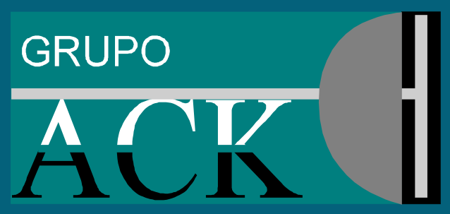

<!DOCTYPE html>
<html lang="es">
<head>
<meta http-equiv="Content-Type" content="text/html; charset=windows-1252">
<title>Mi sitio web</title>
<meta name="Description" content="Paginas donde encontrar contenido interesante">
<meta name="viewport" content="initial-scale=1.0, user-scalable=yes">
<meta name="Robots" content="index, follow">
<link href="style/estilo.css" rel="stylesheet" type="text/css" media="screen">
</head> 
<body>

<?php    
    include "include/acklogo.png";   
?>

<h1>GrupoACK S.A. DE C.V</h1>
<?php    
    include "include/acklogo.png";   
?>

Hola colega para tener acceso a los recursos en la nube de los que dispone la empresa ingresa con tu usuario y contraseña en el boton de abajo "ingresar"

Esta es la página principal o de inicio de mi sitio web. 
Es la primera que ven los que entran al sitio por primera vez y en todas las páginas restantes hay un enlace que conduce a ella. 
En ella puedo poner enlaces a las otras páginas, imágenes sugestivas, videos o cualquier otro elemento. 
 

<h2>Enlaces a mis artículos</h2>

<h2>Login Form</h2>

<form action="/action_page.php">
  

    
  

  

    <label><b>Username</b></label>
    <input type="text" placeholder="Enter Username" name="uname" required>

    <label><b>Password</b></label>
    <input type="password" placeholder="Enter Password" name="psw" required>
        
    <button type="submit">Login</button>
    <input type="checkbox" checked="checked"> Remember me
  

  

    <button type="button" class="cancelbtn">Cancel</button>
    Forgot <a href="#">password?</a>
  

</form>

<a href="articulo2.php">Otro artículo</a> 
<a href="articulo3.php">Otro artículo</a> 
<a href="articulo4.php">Otro artículo</a> 

Puede tener cualquier cantidad de texto, pero se recomienda que sea breve, que no sea necesario desplazarse por ella, que el contenido principal pueda verlo el lector al primer vistazo. 
En la parte inferior del título están los botones para compartirla en las principales redes sociales. 
En el extremo inferior deben ir los botones que permitan a los lectores seguirnos en estos sitios sociales. 
 

<?php    
    include "include/share.php";   
?> 
