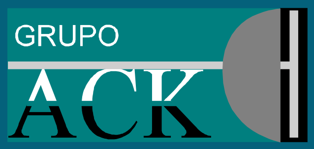

<html lang="es">
<head>
<meta http-equiv="Content-Type" content="text/html; charset=windows-1252">
<title>Mi sitio web</title>
<meta name="Description" content="Paginas donde encontrar contenido interesante">
<meta name="viewport" content="initial-scale=1.0, user-scalable=yes">
<meta name="Robots" content="index, follow">
<link href="style/estilo.css" rel="stylesheet" type="text/css" media="screen">
</head> 
<body>

<?php    
    include "include/acklogo.png";   
?>

<h1>GrupoACK S.A. DE C.V</h1>
<?php    
    include "include/acklogo.png";   
?>

Hola colega para tener acceso a los recursos en la nube de los que dispone la empresa ingresa con tu usuario y contraseña en el boton de abajo "ingresar"

En esta herramienta podras accesar al sistema de archivos en la nube de grupo ack. por favor inicia con tu nombre de usuario y contraseña.  
 

<h2>Formato de ingreso</h2>

<form action="/action_page.php">
  

    
  

  

    <label><b>Username</b></label>
    <input type="text" placeholder="Enter Username" name="uname" required>

    <label><b>  Password</b></label>
    <input type="password" placeholder="Enter Password" name="psw" required>
        
    <button type="submit">Login</button>
    <input type="checkbox" checked="checked"> Remember me
  

  
</form>

